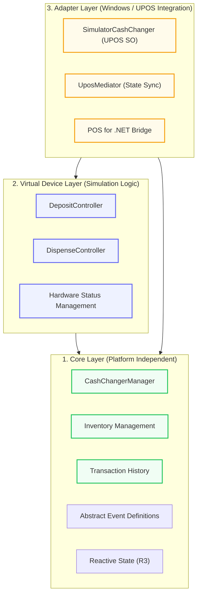

# CashChanger Simulator - Architecture Overview

This document describes the architectural design of the CashChanger Simulator application. The simulator adopts a modular structure that minimizes dependency on Windows (UPOS) and enables multi-platform deployment.

## 3-Tier Decoupling

The simulator is separated into three primary projects: business logic, virtual device control, and an external interface (UPOS adapter).

## Key Components

### 1. Core Layer (`CashChangerSimulator.Core`)

- **Role**: Maintains fundamental cash changer data structures and business logic independent of hardware or UI.
- **Platform Independence**: Operates as a pure .NET library with zero dependency on `Microsoft.PointOfService`.
- **Reactive Features**: Leverages R3's `ReadOnlyReactiveProperty` for elegant state propagation from internal logic to outer layers.
- **Abstract Event Support**: Introduced Core-side event types to further decouple logic from platform-specific SDKs.

### 2. Virtual Device Layer (`CashChangerSimulator.Device.Virtual`)

- **Role**: Simulates the behavior of physical devices in software.
- **Logic Control**: Manages the lifecycle of deposit sequences, dispense timing, and simulation of errors (e.g., jams).
- **Controllers**: `DepositController` and `DispenseController` reside in this layer and interact with the Core `Inventory`.

### 3. Adapter Layer (`CashChangerSimulator.Device.PosForDotNet`)

- **Role**: Adapts virtual device functionality to the standard Windows **POS for .NET (UPOS)** interface.
- **Adapter Pattern**: `UposMediator` acts as a bridge, converting asynchronous events from the virtual device into UPOS `DataEvent` or `StatusUpdateEvent` notifications.
- **Isolated Dependency**: Only this project depends on the `Microsoft.PointOfService` DLL, allowing for easy migration to other platforms (e.g., Linux) by simply replacing this layer.

## Benefits of the Design

1. **Portability**: Since the core logic and simulation are decoupled from Windows SDKs, consistent behavior can be guaranteed on Web APIs or Linux CLIs.
2. **Testability**: `Device.Virtual` can be tested in isolation, allowing verification of simulation logic without expensive hardware or Windows SDK environments.
3. **Extensibility**: Adding new communication methods (e.g., gRPC, Web Serial) only requires adding a new adapter project.

## Reliability & Synchronization Hardening

The project prioritizes reliability, especially during asynchronous operations like cash dispensing.

- **Deterministic State Transitions**: `DispenseController` ensures that internal state updates occur precisely before invoking completion callbacks, allowing `UposMediator` to finalize all properties before firing events.
- **R3 Reactive Sync**: Hardware states are synchronized through observable streams, ensuring UI and infrastructure layers always see a consistent snapshot of the machine.
- **Resource Discipline**: Every component follows the `CompositeDisposable` pattern, guaranteeing that hardware polling or background tasks are terminated immediately upon disposal.
- **UPOS-Compliant Error Mapping**: `DeviceErrorCode` strictly adheres to UPOS/OPOS standard values.

---
*For the Japanese version, see [Architecture_JP.md](Architecture_JP.md).*
