# CashChanger Simulator - Architecture Overview

This document provides a high-level overview of the architectural components within the CashChanger Simulator application. The simulator aims to provide a reliable, modular, and WPF-based simulated environment for cash changer devices (such as UPOS automated teller machines).

## High-Level Architecture

The simulator is structured into several modular layers, separating the user interface, device simulation, and core business logic.

```mermaid
graph TD
    %% Define Styles
    classDef uiLayer fill:#eef2ff,stroke:#6366f1,stroke-width:2px;
    classDef coreLayer fill:#f0fdf4,stroke:#22c55e,stroke-width:2px;
    classDef deviceLayer fill:#fffbeb,stroke:#f59e0b,stroke-width:2px;
    classDef infraLayer fill:#f8fafc,stroke:#94a3b8,stroke-width:2px;
    
    %% UI Layer
    subgraph UI ["Presentation Layer (WPF)"]
        MainWindow["MainWindow"]
        DepositView["Deposit View / ViewModel"]
        DispenseView["Dispense View / ViewModel"]
        PosView["POS Transaction ViewModel"]
        AdvancedSim["Advanced Simulation (Script, Events)"]
        ActivityFeed["Activity Feed (Real-time Events)"]
    end
    class MainWindow,DepositView,DispenseView,PosView,AdvancedSim,ActivityFeed uiLayer

    %% Device/Service Layer
    subgraph Device ["Device Layer"]
        DepositController["DepositController"]
        DispenseController["DispenseController"]
        SimCashChanger["SimulatorCashChanger (Hardware facade)"]
        CashCountParser["CashCountParser (UPOS String Parser)"]
        ScriptService["ScriptExecutionService"]
    end
    class DepositController,DispenseController,SimCashChanger,CashCountParser,ScriptService deviceLayer

    %% Core Layer
    subgraph Core ["Core Business Logic"]
        Manager["CashChangerManager"]
        Inventory["Inventory Management"]
        History["Transaction History"]
        Calc["ChangeCalculator"]
        OposCode["UPOS/OPOS Error Definitions"]
    end
    class Manager,Inventory,History,Calc,OposCode coreLayer

    %% Infrastructure
    subgraph Infrastructure ["Cross-Cutting / Infrastructure"]
        Logger["ZLogger (High-perf structured logging)"]
        Config["SimulationSettings (TOML)"]
    end
    class Logger,Config infraLayer

    %% Relationships
    MainWindow --> DepositView
    MainWindow --> DispenseView
    MainWindow --> PosView
    MainWindow --> AdvancedSim
    MainWindow --> ActivityFeed

    DepositView --> DepositController
    DispenseView --> DispenseController
    AdvancedSim --> ScriptService
    AdvancedSim --> SimCashChanger

    DepositController --> Manager
    DepositController --> SimCashChanger
    
    DispenseController --> Manager
    DispenseController --> SimCashChanger
    
    ScriptService --> SimCashChanger
    
    SimCashChanger --> CashCountParser
    SimCashChanger --> OposCode
    
    Manager --> Inventory
    Manager --> Calc
    Manager --> History
    
    SimCashChanger --> Logger
    Manager --> Logger
    ActivityFeed --> History
```

## Key Components

1. **Presentation Layer (`CashChangerSimulator.UI.Wpf`)**
    - Built using **WPF (Windows Presentation Foundation)** with **MaterialDesignThemes**.
    - Utilizes **R3** (Reactive Extensions) for highly responsive and declarative View-ViewModel binding interactions.
    - **Activity Feed**: Integrates directly with `TransactionHistory` to show real-time `DataEvent` and `StatusUpdateEvent` notifications, especially useful when `RealTimeDataEnabled` is active.
    - Components such as `AdvancedSimulationWindow` provide deep manipulation and stress-testing functionality via JSON script automation.

2. **Device Layer (`CashChangerSimulator.Device`)**
    - Coordinates between high-level business operations and simulated hardware.
    - **`SimulatorCashChanger`**: The primary UPOS service object facade. It handles `DirectIO` extensions (e.g., bulk adjustment, discrepancy simulation) and manages asynchronous task states.
    - **`CashCountParser`**: A specialized parser for UPOS-standard semicolon-separated strings (e.g., `Coins;Bills`). Supports currency factor scaling and decimal shorthands (e.g., `.5`).
    - `DepositController` and `DispenseController` orchestrate operations by simulating real-world physics and timings before invoking the actual business counts.

3. **Core Layer (`CashChangerSimulator.Core`)**
    - Independent of UI and infrastructure.
    - Holds the `CashChangerManager` containing invariants such as absolute inventory totals and log histories.
    - **Error Handling**: Standardized via `UposCashChangerErrorCodeExtended` to ensure compliance with OPOS/UPOS extended result codes (e.g., `OverDispense`).
    - `ChangeCalculator` algorithms compute optimal denominations for dispensing operations based on the current available inventory structure.

4. **Infrastructure Layer**
    - Uses **ZLogger** mapped dynamically at runtime to handle massive throughput of UPOS events without freezing the presentation thread.
    - Configuration is managed via **TOML** files, allowing for easy customization of currencies and denominations.

---
*For the Japanese version, see [Architecture_JP.md](Architecture_JP.md).*
