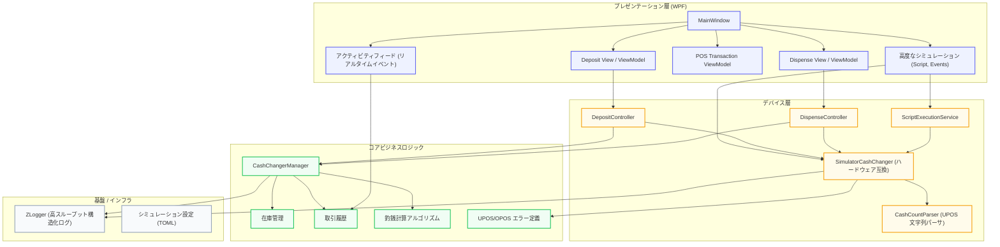

# CashChanger Simulator - アーキテクチャ概要

このドキュメントでは、CashChanger Simulator アプリケーションのアーキテクチャ構成について説明します。本シミュレーターは、信頼性が高く拡張性に優れた、WPFベースの釣銭機デバイス（UPOS 準拠の自動預け払い機など）のシミュレーション環境を提供することを目的としています。

## ハイレベル・アーキテクチャ

シミュレーターは、ユーザーインターフェース、デバイスシミュレーション、およびコアビジネスロジックを分離した、複数のモジュール層で構成されています。

## 主要コンポーネント

1. **プレゼンテーション層 (`CashChangerSimulator.UI.Wpf`)**
    - **WPF (Windows Presentation Foundation)** と **MaterialDesignThemes** を使用して構築されています。
    - **R3** (Reactive Extensions) を活用し、応答性の高い View-ViewModel バインディングを実現しています。
    - **アクティビティフィード**: `TransactionHistory` と直接連携し、`RealTimeDataEnabled` が有効な場合の `DataEvent` や `StatusUpdateEvent` をリアルタイムに表示します。
    - `AdvancedSimulationWindow` などのコンポーネントにより、JSON スクリプトによる高度なストレス・シナリオテストが可能です。

2. **デバイス層 (`CashChangerSimulator.Device`)**
    - ビジネスロジックと仮想ハードウェア間の調整を行います。
    - **`SimulatorCashChanger`**: UPOS サービスオブジェクトの本体です。`DirectIO` による独自拡張（一括在庫調整、不一致シミュレーション等）や、非同期処理の状態管理を担当します。
    - **`CashCountParser`**: UPOS 標準のセミコロン区切り形式（例：`Coins;Bills`）を解析する専用パーサです。通貨係数によるスケーリングや、小数の省略形式（例：`.5`）に対応しています。
    - `DepositController` および `DispenseController` は、物理的なモータ遅延やカセットの状態をシミュレートした上で、コアロジックを呼び出します。

3. **コア層 (`CashChangerSimulator.Core`)**
    - UI やインフラストラクチャに依存しない独立した層です。
    - `CashChangerManager` が在庫の総計やログ履歴などの不変条件を保持します。
    - **エラー処理**: `UposCashChangerErrorCodeExtended` を通じてエラー定義を標準化し、OPOS/UPOS の拡張ResultCode（`OverDispense` 等）への準拠を保証しています。
    - `ChangeCalculator` アルゴリズムが、現在の在庫構成に基づいた最適な金種組み合わせを計算します。

4. **インフラストラクチャ層**
    - **ZLogger** を使用し、UI スレッドをブロックすることなく大量のイベントログを高速に出力します。
    - 設定管理には **TOML** ファイルを採用しており、通貨や金種の定義を容易にカスタマイズ可能です。

---
*英語版については、[Architecture.md](Architecture.md) を参照してください。*
