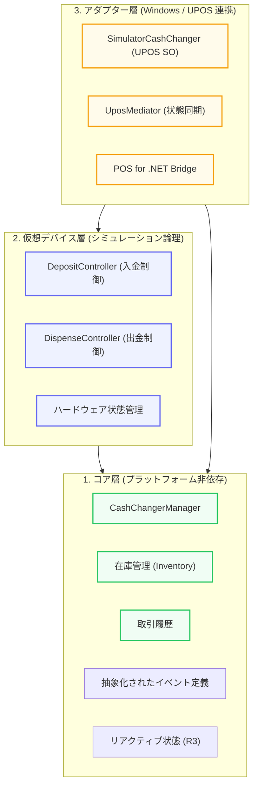

# CashChanger Simulator - アーキテクチャ概要

このドキュメントでは、CashChanger Simulator アプリケーションのアーキテクチャ構成について説明します。本シミュレーターは、Windows (UPOS) への依存を最小限に抑え、マルチプラットフォーム展開が可能なモジュール化された構造を採用しています。

## 3層構造によるデカップリング

シミュレーターは、ビジネスロジック、仮想デバイス制御、および外部インターフェース（UPOS アダプター）の 3 つの主要なプロジェクトに分離されています。

## 主要コンポーネント

### 1. コア層 (`CashChangerSimulator.Core`)

- **役割**: ハードウェアや UI に依存しない、釣銭機の基本的なデータ構造とビジネスロジックを保持します。
- **プラットフォーム非依存**: `Microsoft.PointOfService` への依存を一切持たず、純粋な .NET ライブラリとして動作します。
- **リアクティブ機能**: R3 の `ReadOnlyReactiveProperty` を活用し、内部ロジックの状態変化を上位層へ効率的に伝搬。
- **抽象イベントの導入**: Core 側に独自のイベント引数型を導入することで、上位コンポーネントを Windows SDK から完全にデカップリング。

### 2. 仮想デバイス層 (`CashChangerSimulator.Device.Virtual`)

- **役割**: 物理的なデバイスの振る舞いをソフトウェア上でシミュレートします。
- **論理制御**: 入金シーケンスのライフサイクルや、出金時のタイミング、エラーシミュレーション（ジャム等）の論理を担当します。
- **コントローラー**: `DepositController` および `DispenseController` はこの層に属し、コア層の `Inventory` を操作します。

### 3. アダプター層 (`CashChangerSimulator.Device.PosForDotNet`)

- **役割**: 仮想デバイスの機能を Windows 標準の **POS for .NET (UPOS)** インターフェースに適合させます。
- **Adapter パターン**: `UposMediator` が仲介役となり、仮想デバイスからの非同期イベントを UPOS の `DataEvent` や `StatusUpdateEvent` に変換して通知します。
- **限定的な依存**: このプロジェクトだけが `Microsoft.PointOfService` DLL に依存しており、他のプラットフォーム（Linux 等）へ移行する際は、この層を差し替えるだけで対応可能です。

## 設計のメリット

1. **ポータビリティ**: コアロジックとシミュレーション論理が Windows SDK から分離されているため、Web API や Linux 上の CLI 等でも同じ動作を保証できます。
2. **テスト容易性**: `Device.Virtual` 単体でテストが可能であり、高価なハードウェアや Windows SDK 環境がなくてもシミュレーションの正当性を検証できます。
3. **柔軟な拡張**: 新しい通信方式（gRPC, Web Serial 等）が必要になった場合、新しいアダプタープロジェクトを追加するだけで済みます。

## 信頼性と同期ハードニング

本プロジェクトでは、特に非同期操作（出金など）における信頼性を重視しています。

- **確定的な状態遷移**: `DispenseController` は内部状態を更新した直後にコールバックを呼び出し、アダプター層がイベントを発行する前にすべてのプロパティが最新であることを保証。
- **R3 によるリアクティブ同期**: ハードウェア状態はストリームを通じて同期され、UI や外部インターフェースが常に一貫性のあるスナップショットを参照できる状態を維持。
- **リソース管理の徹底**: 全コンポーネントで `CompositeDisposable` パターンを採用し、ポーリングやバックグラウンドタスクが破棄時に即座かつ確実に停止することを保証。
- **UPOS 準拠のエラーマッピング**: `DeviceErrorCode` は UPOS/OPOS 標準の整数値に厳密に準拠。

---

*英語版については、[Architecture.md](Architecture.md) を参照してください。*
